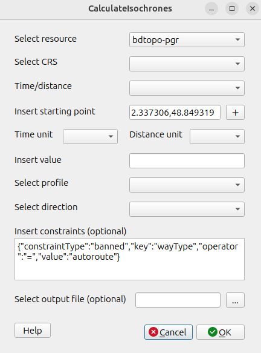
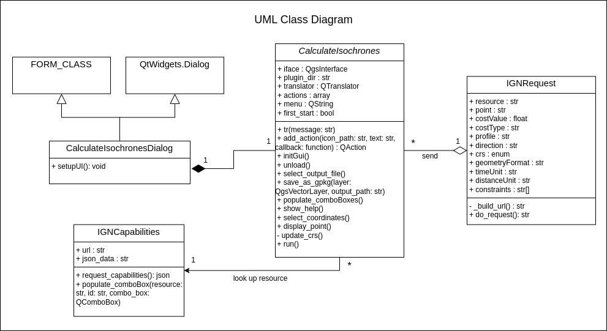
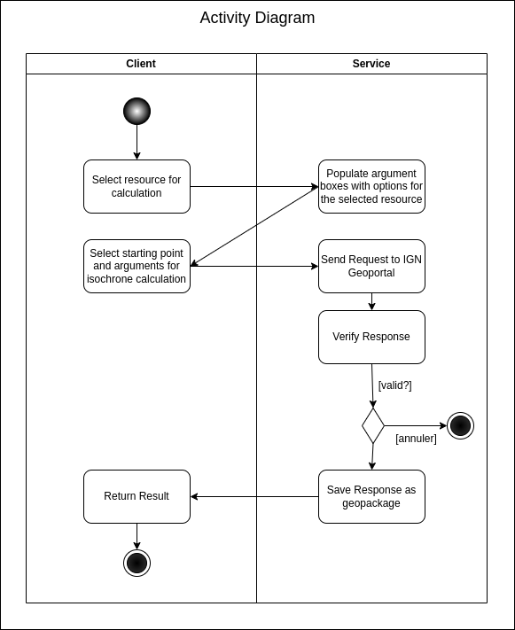

# QGIS Plugin OOP

This Plugin is developed as part of a course on Object Oriented Programming (OOP) at ENSG, year 2025-2026.

The Plugin calculates a polygon from a starting point inserted by the user.
The result represents a geolocated surface where all points inside of the polygon can be reached in a certain time/distance. 
For the implementation, the geoportal service of IGN is used:
https://geoservices.ign.fr/services-geoplateforme-itineraire

The IGN Geoportal isochrone API can be tested here:
https://www.geoportail.gouv.fr/depot/swagger/itineraire.html#/Utilisation/isochrone


## Usage
1. Clone the repository 

    ```bash
    git clone
    ```

2. Move the folder (or create a symbolic link) to the plugin directory of QGIS e.g. located at 
```/home/user/.local/share/QGIS/QGIS3/profiles/default/python/plugins```

3. Add the Plugin to your QGIS Project via Plugins -> Manage and Install Plugins...

4. When running the Plugin, first select the resource (all other drop boxes are populated depending on the resource!)

5. Select all other parameters and execute
    #### Note:
    Calculations with to small or big values (e.g. distance of 1m, time of 300h) get a return code of 404 from IGN Geoportal and cause an error message in QGIS

## Graphical User Interface


## Parameter Descriptions

### Resource
| Name              | Description                                                                 | Bbox                                      |
|-------------------|-----------------------------------------------------------------------------|--------------------------------------------------|
| **bdtopo-pgr**   | Route/Isochrone service publication via PGRouting           | -63.28125,-21.421484375, 55.8984375,51.27109375 |
| **bdtopo-valhalla**| Publication of the Route via Valhalla service                       | -63.28125,-21.42148437, 55.8984375,51.27109375  |
| **pgr_sgl_r100_all**| Publication of the Seine Grands Lacs Route service (Scenario R100) / Isochrone via PGRouting | 1.428222656,48.110546875, 3.449707031,49.207958984 |

---

### CRS
Projection used to express coordinates and retrieve geometries.
The selected starting point will be transformed into this CRS

---

### Time/Distance
Calculate either **isochrones** (time-based) or **isodistances** (distance-based)

---

### Starting Point
Starting point of calculation

---

### Profile
Means of transport used for the calculation
e.g. `"car"`

---

### Direction
Direction of travel used for the calculation

---

### Constraints
<details>
  <summary>Click to expand JSON documentation</summary>


    Note: For the resource "bdtopo-valhalla" only the key "waytype" is available

```json
[{
    "key": "waytype",
    "availableConstraintType": [
        "banned"
    ],
    "availableOperators": [
        "=",
        "!="
    ],
    "values": [
        "autoroute",
        "tunnel",
        "pont"
    ]
},
{
    "key": "largeur_de_chaussee",
    "availableConstraintType": [
        "banned"
    ],
    "availableOperators": [
        "=",
        "!=",
        ">",
        ">=",
        "<",
        "<="
    ]
},
{
    "key": "importance",
    "availableConstraintType": [
        "banned",
        "prefer",
        "avoid"
    ],
    "availableOperators": [
        "=",
        "!=",
        ">",
        ">=",
        "<",
        "<="
    ]
},
{
    "key": "nature",
    "availableConstraintType": [
        "banned"
    ],
    "availableOperators": [
        "=",
        "!="
    ],
    "values": [
        "sentier",
        "bac_ou_liaison_maritime",
        "bretelle",
        "chemin",
        "escalier",
        "piste_cyclable",
        "rond-point",
        "route_a_1_chaussee",
        "route_a_2_chaussees",
        "route_empierree",
        "type_autoroutier"
    ]
},
{
    "key": "restriction_de_hauteur",
    "availableConstraintType": [
        "banned"
    ],
    "availableOperators": [
        "=",
        "!=",
        ">",
        ">=",
        "<",
        "<="
    ]
},
{
    "key": "restriction_de_largeur",
    "availableConstraintType": [
        "banned"
    ],
    "availableOperators": [
        "=",
        "!=",
        ">",
        ">=",
        "<",
        "<="
    ]
},
{
    "key": "restriction_de_poids_total",
    "availableConstraintType": [
        "banned"
    ],
    "availableOperators": [
        "=",
        "!=",
        ">",
        ">=",
        "<",
        "<="
    ]
},
{
    "key": "restriction_de_poids_par_essieu",
    "availableConstraintType": [
        "banned"
    ],
    "availableOperators": [
        "=",
        "!=",
        ">",
        ">=",
        "<",
        "<="
    ]
},
{
    "key": "matieres_dangereuses_interdites",
    "availableConstraintType": [
        "banned"
    ],
    "availableOperators": [
        "=",
        "!="
    ],
    "values": [
        "vrai",
        "faux"
    ]
},
{
    "key": "itineraire_vert",
    "availableConstraintType": [
        "banned",
        "prefer",
        "avoid"
    ],
    "availableOperators": [
        "=",
        "!="
    ],
    "values": [
        "vrai",
        "faux"
    ]
},
{
    "key": "cpx_classement_administratif",
    "availableConstraintType": [
        "banned",
        "prefer",
        "avoid"
    ],
    "availableOperators": [
        "=",
        "!="
    ],
    "values": [
        "vide",
        "autoroute",
        "nationale",
        "departementale",
        "voie_communale",
        "chemin_rural"
    ]
}]
```
</details>

Further read:
https://data.geopf.fr/navigation/getcapabilities


## Documentation



