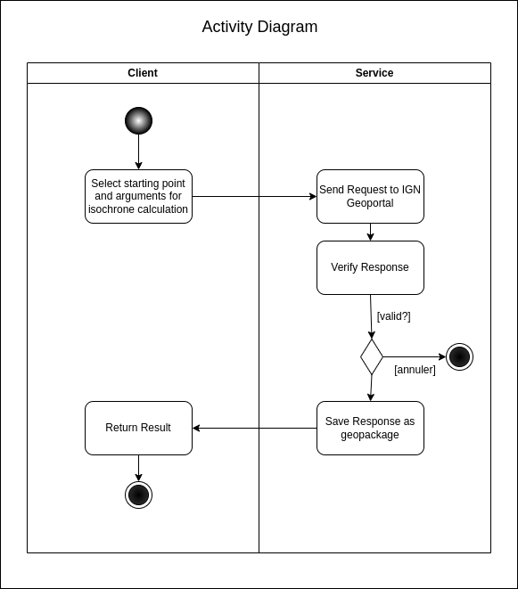
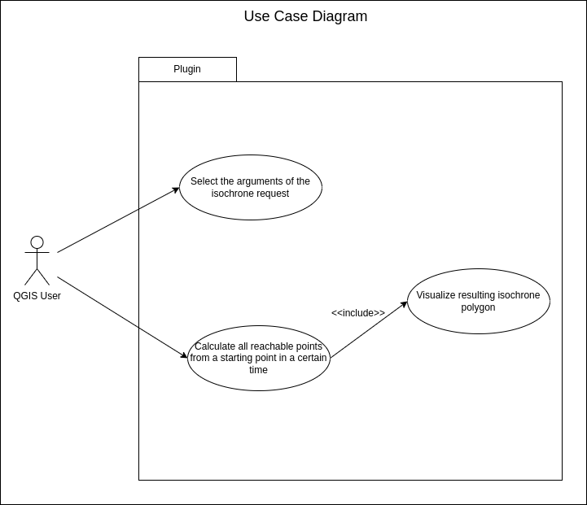

# QGIS Plugin OOP

This Plugin is developed as part of a course on Object Oriented Programming (OOP) at ENSG, year 2025-2026.

The Plugin calculates a polygon from a starting point inserted by the user.
The result represents a geolocated surface where all points inside of the polygon can be reached in a certain time. 
For the implementation, the geoportal service of IGN is used:
https://geoservices.ign.fr/services-geoplateforme-itineraire

The IGN Geoportal isochrone API can be tested here:
https://www.geoportail.gouv.fr/depot/swagger/itineraire.html#/Utilisation/isochrone

## Documentation

